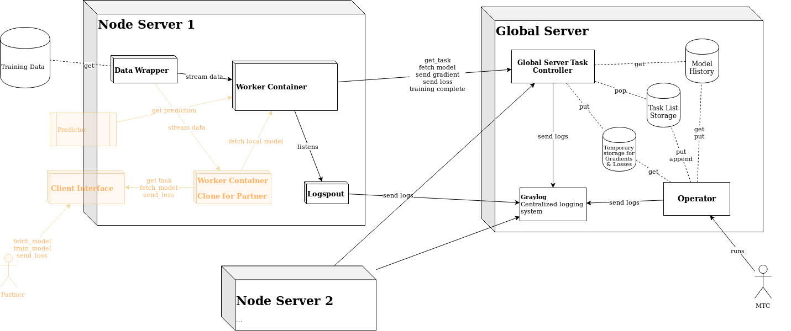
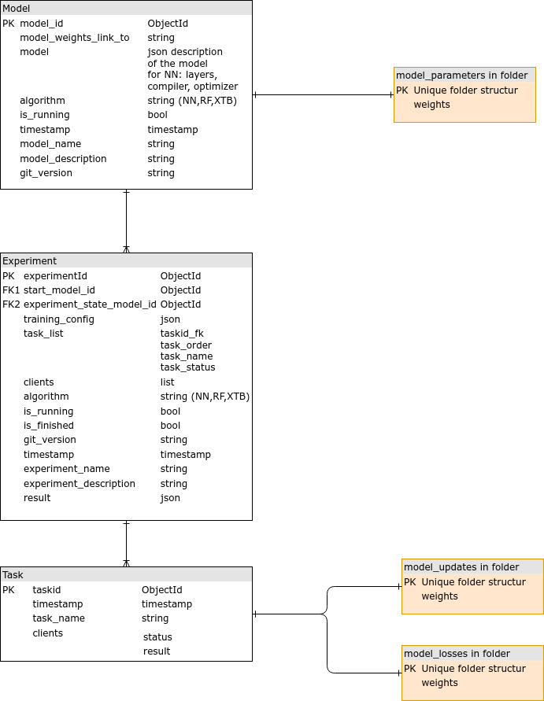

# Pipeline Description
The basic workflow is as follows:
1. Operator defines model. (Configuration stored in collection `model`. Parameters stored in `db/global_models` as json.)
2. Operator defines Experiment consisting of a model, clients and a task list.  (Experiment is stored in collection `experiment`. It automatically creates a model which is the model of the current state in the experiment. This model `experiment_state_model_id_` is stored as every model.)
3. Operator starts Experiment.
4. API/GlobalTaskController looks up the next experiment containing the next task to send to the client (when they call get_net_task) and marks that task as `scheduled`
5a. Client/Node fulfills tasks and returns to the API with the corresponding responses (look below for the list of tasks).
5b. On task `aggregate`, operator aggregates new global_model.
6. API marks tasks as `done` and stores the response in the database `task.result` resp. in `db/local_model_updates`.
7. Go to 4.

The protobuf file defining the communication parameters between server and node is in [globalserver.proto](../globalserver/api/utils/globalserver.proto),

# Task Descriptions:
A task always contains three parameters:  
`task`: the task to do 
`experiment_id`: experiment_id  
`protocol`: model_architecture we use NN/P2P/RF

## fetch_model
When the Node receives `fetch_model` it calls `fetch_model_request` on the API. The API looks up the model parameters (defined in step 1 resp. 2) of the current experiment state `model_name` in `db/global_models`, returns it to the Node and marks the task as done. For NN the Node compiles the model and sets it as the local model (`node.py NN_fetch_model`).

## train_model
For NN when the Node receives `train_model` it trains the local model with the configurations received in `fetch_model` and the training data provided (`node.py NN_train_model`) . When it finished the training it calls `train_model_response` on the API which marks the task as done.

## send_model_update
For NN , when the Node receives `send_model_update` it calculates the difference of the weights between the initial model received in `fetch_model` and the local model and streams it to the global server by calling `send_model_updates_response` on the API (`NN_sond_model_update`). The API then stores the update in `db/local_model_updates/{task_id}_{client}.json}`.

## send_loss
When the Node receives `send_loss` it evaluates the local model on the local test set and sends the loss/metrics to the API by calling `send_loss_response`. The API stores the losses in `db/local_model_updates/{task_id}_{client}.json}`

## aggregate
On task `aggregate` the Nodes stay idle. The Operator gathers all model updates `db/global_models/{task_id}_{client}.json` (from the most recent `send_model_update` task). For NN it aggregates the weights and updates the current experiment state model parameters to the aggregated weights.(`operator_class_db.py NN_aggregate`)

# Database
See example entry of collection  [model](db/model.json),   [collection](db/collection.json),   [task](db/task.json)

Experiment status:
is_finished: is True if all tasks are done \
is_running: is True if there are Workers working on the experiment \
has_error: is True if an error occured \
if is_finished and is_running is True, then all tasks are done but the Workers are not yet cancelled 

# P2P documentation

To run and test peer2peer implementation (federated gradient boosting trees) set the parameter `model_type='P2P'` in `operator_example.py` script before running it. 
XGBoost model parameters are specified in dictionary `xgboost_model_params`. For all available parameters refer to xgboost docs: https://xgboost.readthedocs.io/en/latest/parameter.html

Peer2peer protocol parameters are specified in dictionary `training_config`. Most important protocol parameters are the following:

- `clients_steps_per_round`: how many trees are built on one client, before we move on to the next client. In basic peer2peer protocol, this parameter is set to 1 (i.e. only one tree gets built on each client in each round).
- `nr_batches`: how much local data is used to fit a single tree. If this parameter is set to 1, all local data is used when fitting a tree on a client. If this parameter is k > 1, only 1/k of data will be built when fitting a tree on a client (entire pass of the local data, i.e. one epoch, happens after k trees are built on a client).
- `optuna_CV`: if False, no cross-validation takes place (inital parameters set in `xgboost_model_params` are used for entire training). If True, optuna library is used to run hyperparameter search before building each tree. Note that CV always takes place locally, i.e. on a client. Hyperparameter search space can be specified in `objective_optuna_P2P` function in `nodeserver/worker/utils/worker_utils.py`. 

Function `diff_privacy_noise_first` in `nodeserver/worker/utils/worker_utils.py` adds differentialy private noise to the data (Laplacian mechanism is used for continuous features and exponential mechanism is used for categorial features). It can used to add noise to the local data prior to training tree models, as well as to add noise to sample dataset, that might be asked from the client, so that some preliminary EDA and feature engineering can be done.

